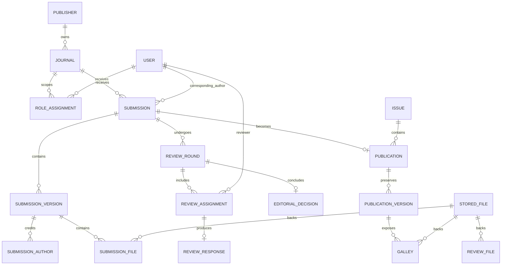

# PRD.md — Scholarly Journal Publishing Platform

- **Working product name:** Aksara Journal Platform
- **Document status:** Approved baseline for implementation
- **Product type:** Multi-journal scholarly submission, peer-review, editorial, and publishing platform
- **Initial market:** Universities, research institutions, associations, and independent scholarly journal publishers in Indonesia
- **Default language:** Indonesian, with English-ready architecture
- **Last updated:** 2026-08-19

---

## 1. Product Definition

Aksara Journal Platform is a web application for managing the full scholarly publishing lifecycle:

1. journal setup;
2. author submission;
3. editorial screening;
4. reviewer assignment and peer review;
5. revisions and decisions;
6. copyediting and production;
7. issue scheduling and publication;
8. public discovery, reading, and metadata distribution.

The product is conceptually closer to a modern journal management and publishing system such as OJS than to Scopus or SINTA.

Scopus and SINTA primarily provide indexing, discovery, citation, evaluation, or journal-profile functions. This project must not claim that content is indexed by either platform. It may prepare high-quality metadata and interoperability endpoints that help legitimate external discovery and indexing processes.

---

## 2. Product Vision

Create trusted, efficient, and transparent scholarly publishing infrastructure that reduces editorial administration without weakening human editorial judgment, confidentiality, research integrity, or publication ethics.

The product should make complex journal workflows understandable to authors, reviewers, and editors while presenting published research through a credible, restrained, and professional public interface.

---

## 3. Core Product Principles

1. **Human editorial authority**  
   Software assists workflow. Editors make editorial decisions.

2. **Workflow integrity**  
   Manuscripts move through validated states, not arbitrary status edits.

3. **Confidentiality by design**  
   Blind-review identity rules and file permissions are enforced server-side.

4. **Metadata quality**  
   Scholarly metadata is structured, validated, versioned, and exportable.

5. **Auditability**  
   Important actions and publication changes leave a durable record.

6. **No false prestige**  
   The platform never fabricates indexing, accreditation, DOI, citation, quartile, impact-factor, or plagiarism claims.

7. **Pragmatic architecture**  
   Start as a modular monolith that can scale operationally without premature distributed-system complexity.

8. **Accessible academic design**  
   Public content and operational dashboards must be readable, responsive, and usable by keyboard and assistive technology.

---

## 4. Goals and Success Measures

### 4.1 Product goals

- Allow an author to submit a complete manuscript without email-based administration.
- Allow editors to see exactly what requires action.
- Support configurable single-blind or double-blind peer review, with double-blind as the default.
- Preserve manuscript versions and review rounds.
- Publish structured article pages, issue pages, and downloadable galleys.
- Support a single publisher operating multiple journals without data leakage.
- Produce consistent metadata suitable for DOI registration and scholarly discovery integrations.
- Reduce repetitive editor communication through templates and event-based notifications.

### 4.2 Initial success measures

Measure after real use begins:

- submission completion rate;
- median time from submission to initial editorial decision;
- median reviewer invitation response time;
- percentage of overdue reviews;
- percentage of submissions with complete required metadata;
- publication error rate;
- public article page performance and accessibility;
- number of support interventions required per submission.

Do not optimize for raw submission volume at the expense of review quality.

---

## 5. Non-Goals

The first product is not:

- a Scopus or SINTA clone;
- an accreditation authority;
- a citation-ranking engine;
- a replacement for Crossref, ORCID, plagiarism vendors, or indexing agencies;
- a social network for researchers;
- a full manuscript word processor;
- an autonomous AI reviewer or acceptance system;
- a billing marketplace;
- a microservice platform;
- a universal institutional repository.

Citation analytics, author reputation scoring, APC payments, and AI-assisted tools are later capabilities and require separate approval.

---

## 6. Product Scope by Release

## 6.1 MVP — Required for first production launch

### Public publishing

- Publisher and journal landing pages
- Journal aims and scope, editorial board, policies, author guidelines, contact information
- Current issue and issue archive
- Article landing page with structured metadata
- Abstract, keywords, authors, affiliations, dates, citation suggestion, license, and references
- Public PDF galley download when published
- Search and filtering across published content
- SEO metadata, canonical URLs, sitemap, robots rules, and scholarly citation meta tags

### Identity and access

- Email/password registration and login
- Email verification
- Password reset
- Secure session management
- User profile with name, affiliation, country, areas of expertise, and optional ORCID iD
- Role-based access with resource-level authorization
- Journal-specific roles

### Submission

- Multi-step submission wizard
- Draft autosave
- Manuscript metadata
- Multiple authors with ordering and corresponding-author designation
- Abstract and keywords
- Subject classification
- Cover letter
- Manuscript and supplementary file upload
- Author checklist and policy agreement
- Conflict-of-interest declaration
- Final confirmation and immutable submission timestamp
- Submission receipt and tracking timeline

### Editorial screening

- New-submission queue
- Completeness check
- Scope and policy screening
- Request pre-review corrections
- Desk reject with decision letter
- Assign editor or section editor
- Internal editorial notes
- Audit trail

### Peer review

- Default double-blind review, configurable per journal
- Reviewer directory and expertise tags
- Reviewer invitation with due date
- Accept or decline invitation
- Conflict declaration
- Review form with confidential comments to editor and comments to author
- File attachment
- Recommendation
- Multiple review rounds
- Reminder notifications
- Editor-visible reviewer status without exposing confidential content to authors

### Editorial decisions and revision

- Reject
- Request major revision
- Request minor revision
- Accept
- Custom decision letter templates
- Author revision response and new manuscript version
- Point-by-point response file
- New review round or editor-only evaluation
- Decision and version history

### Copyediting and production

- Copyediting task assignment
- Author query and response
- Production file management
- PDF galley upload
- Metadata quality check
- Assign article to issue
- Schedule or publish immediately
- Public preview before publication

### Journal and issue administration

- Create and configure journals
- Journal branding configuration within approved design constraints
- Sections and article types
- Review settings
- Email templates
- Submission checklist
- Issue, volume, number, year, title, cover, and publication date
- Editorial team role assignment

### Notifications

- In-app notifications
- Transactional email through queued jobs
- Notification preferences for non-critical events
- Required workflow notifications cannot be disabled when doing so would break process integrity

### Audit and operations

- Append-only audit log for privileged actions
- Admin activity view
- Failed-job view
- Basic operational metrics
- Structured application logs and request IDs
- Backup and restore procedure

---

## 6.2 Release 1.1 — Priority enhancements

- ORCID OAuth connection and authenticated ORCID iD collection
- Crossref DOI deposit adapter and deposit-status tracking
- OAI-PMH metadata endpoint
- XML and CSV metadata export
- Bilingual interface and journal content
- Reviewer workload indicators
- Reviewer suggestion based on declared expertise, without automatic assignment
- Saved editorial filters and bulk reminders
- Plagiarism report upload and optional vendor adapter
- Article corrections, expressions of concern, withdrawal, and retraction workflow
- Public usage metrics with bot filtering
- Admin MFA
- Webhook subscriptions for trusted integrations

---

## 6.3 Release 2 — Advanced publishing

- JATS XML representation and validation
- HTML full-text article rendering from approved structured content
- Crossmark or equivalent update metadata integration after separate approval
- Data and supplementary-material linking
- CRediT contributor roles
- Funding metadata
- Citation parsing and reference DOI resolution
- Reviewer recognition integration, subject to confidentiality policy
- APC invoicing and payment only after legal, accounting, refund, and security requirements are approved
- Advanced search service if PostgreSQL search is no longer sufficient
- Institutional SSO
- Public API with scoped keys and usage policy

---

## 7. Users and Roles

A user may hold multiple roles and different roles in different journals.

### 7.1 Guest / Reader

Can:

- browse journals, issues, and published articles;
- search public content;
- download public galleys;
- view publication policies and metadata.

Cannot access any unpublished file, review, or editorial activity.

### 7.2 Author

Can:

- manage own profile;
- create and submit manuscripts;
- invite or add co-authors as allowed;
- view own submission timeline;
- respond to revision, copyediting, and production requests;
- access author-visible files and decisions.

Cannot view reviewer identities or confidential editorial comments in a blind workflow.

### 7.3 Reviewer

Can:

- view only assigned submissions after accepting confidentiality terms;
- accept or decline invitations;
- declare conflicts;
- submit review content and recommendations;
- revise a review before the review deadline or editor lock.

Cannot access unrelated submissions, editorial decisions before release, or author identity in double-blind review.

### 7.4 Copyeditor

Can:

- access accepted submissions assigned for copyediting;
- manage copyediting files and queries;
- communicate within the copyediting stage.

Cannot make final editorial decisions unless also assigned an editorial role.

### 7.5 Layout / Production Editor

Can:

- prepare and manage publication galleys;
- perform metadata quality checks;
- create publication previews.

Cannot publish unless granted publication permission.

### 7.6 Section Editor / Handling Editor

Can:

- manage assigned submissions;
- invite reviewers;
- monitor reviews;
- recommend or issue decisions according to journal policy;
- request revisions.

### 7.7 Editor-in-Chief

Can:

- access all journal submissions;
- make final decisions;
- override assignments with an audited reason;
- approve publication;
- manage editorial policy within journal permissions.

### 7.8 Journal Manager

Can:

- configure a journal;
- manage roles, sections, templates, and workflow settings;
- manage issues and publication settings;
- view journal-level operations and reports.

Cannot silently alter confidential review history or published records.

### 7.9 Platform Administrator

Can:

- create and suspend journals;
- manage platform-level configuration;
- manage operational incidents;
- access system diagnostics.

Access to manuscript content must be exceptional, purpose-limited, and audited.

---

## 8. Editorial Workflow State Machine

### 8.1 Primary submission states

```text
DRAFT
  -> SUBMITTED
  -> INITIAL_SCREENING
  -> PRE_REVIEW_CORRECTION_REQUESTED
  -> EDITOR_ASSIGNED
  -> UNDER_REVIEW
  -> REVISION_REQUIRED
  -> RESUBMITTED
  -> ACCEPTED
  -> COPYEDITING
  -> PRODUCTION
  -> SCHEDULED
  -> PUBLISHED
```

Terminal or exceptional states:

```text
DESK_REJECTED
REJECTED
WITHDRAWN
DECLINED_BY_JOURNAL
RETRACTED
ARCHIVED
```

### 8.2 Required transition behavior

- `DRAFT -> SUBMITTED` requires all mandatory metadata, required files, verified corresponding-author email, and accepted declarations.
- `SUBMITTED -> INITIAL_SCREENING` may occur immediately through a transaction.
- A desk rejection requires an authorized editor and decision letter.
- `EDITOR_ASSIGNED -> UNDER_REVIEW` requires at least one active reviewer invitation or an explicit editor-approved no-external-review route for a configured article type.
- `UNDER_REVIEW -> REVISION_REQUIRED` records round number and decision letter.
- `REVISION_REQUIRED -> RESUBMITTED` requires a new manuscript version and response to reviewers when configured.
- `ACCEPTED` freezes the accepted manuscript version as the production source unless an audited correction is made.
- `PRODUCTION -> SCHEDULED` requires publication metadata validation and at least one approved public galley or approved HTML full text.
- `SCHEDULED -> PUBLISHED` creates a permanent publication event and public URL.
- Published content is not returned to an unpublished state. Corrections, withdrawal, and retraction use explicit publication-update workflows.

### 8.3 Review rounds

Each review round stores:

- sequence number;
- start and close dates;
- manuscript version reviewed;
- assigned editor;
- reviewer invitations;
- submitted reviews;
- decision;
- decision letter;
- author-visible files;
- confidential files;
- audit events.

---

## 9. Core User Journeys

## 9.1 Author submission

1. User creates and verifies an account.
2. User selects a journal and reads scope and submission requirements.
3. User creates a draft.
4. User enters article type, title, abstract, keywords, and subject data.
5. User adds authors and affiliations in publication order.
6. User uploads manuscript and supplementary files.
7. User completes declarations and checklist.
8. System validates completeness.
9. User reviews a final summary and submits.
10. System records submission time, creates an audit event, queues receipt email, and opens author tracking view.

### Acceptance criteria

- Refreshing or leaving the wizard does not lose saved progress.
- An author cannot submit an incomplete manuscript.
- Final submission is idempotent and cannot create duplicates on repeated clicks.
- Private files cannot be fetched with a guessed URL.
- The author sees a clear next step and current status.

## 9.2 Editor initial screening

1. Editor sees unassigned new submissions ordered by urgency.
2. Editor opens manuscript metadata, declarations, and files.
3. Editor records screening checks.
4. Editor requests correction, desk rejects, or assigns a handling editor.
5. The system logs the decision and notifies the author when applicable.

### Acceptance criteria

- Only authorized journal editors can screen submissions.
- Internal notes never appear in author responses.
- Every decision includes actor and timestamp.
- A correction request identifies required changes.

## 9.3 Reviewer assignment and review

1. Editor searches reviewer directory by expertise and availability.
2. Editor invites a reviewer with due dates.
3. Reviewer accepts or declines and declares conflict status.
4. On acceptance, reviewer receives time-limited authorized access.
5. Reviewer completes form, comments, files, and recommendation.
6. System locks or versions the review after submission according to policy.
7. Editor is notified.

### Acceptance criteria

- Double-blind journals never expose author identity through metadata, filenames, download headers, or UI fields available to reviewers.
- Reviewer invitation tokens are single-use, expiring, and stored safely.
- Declined or expired reviewers lose manuscript access.
- Review forms distinguish author-visible and editor-confidential content.

## 9.4 Revision

1. Author receives decision and reviewer comments approved for release.
2. Author uploads a revised manuscript and response document.
3. System creates a new version linked to the prior version.
4. Editor chooses editor-only evaluation or a new review round.

### Acceptance criteria

- Old versions remain available to authorized users.
- Reviewers only see versions assigned to their round.
- Author cannot alter the previous submitted version.

## 9.5 Publication

1. Accepted manuscript enters copyediting.
2. Copyeditor resolves queries with author.
3. Production editor uploads approved galley and verifies metadata.
4. Editor assigns issue, publication date, license, and citation fields.
5. System generates preview.
6. Authorized editor schedules or publishes.
7. Public pages, search index, sitemap, and metadata feeds update.
8. DOI deposit runs only when a valid integration is configured.

### Acceptance criteria

- Publication is idempotent.
- Public URL is stable.
- DOI is shown only after a valid DOI has been assigned and deposit state permits display.
- Failed external deposits do not unpublish the article; they show an operational failure for authorized staff.

---

## 10. Functional Requirements

Identifiers use `FR-<domain>-<number>`.

### 10.1 Identity and access

- **FR-IAM-001:** Register using email and password.
- **FR-IAM-002:** Verify email before submitting a manuscript.
- **FR-IAM-003:** Reset password with a one-time expiring token.
- **FR-IAM-004:** Support concurrent journal-specific roles.
- **FR-IAM-005:** Revoke sessions from profile and administration.
- **FR-IAM-006:** Record security-relevant authentication events.
- **FR-IAM-007:** Support ORCID OAuth in Release 1.1.

### 10.2 Journal management

- **FR-JRN-001:** Create multiple journals under one platform.
- **FR-JRN-002:** Configure title, abbreviation, ISSN fields, description, scope, contacts, policies, and branding.
- **FR-JRN-003:** Configure sections and article types.
- **FR-JRN-004:** Configure review model and deadlines.
- **FR-JRN-005:** Configure submission checklist, declarations, and templates.
- **FR-JRN-006:** Isolate all journal-owned data by `journalId`.

### 10.3 Submissions

- **FR-SUB-001:** Create and autosave submission drafts.
- **FR-SUB-002:** Validate required metadata by journal and article type.
- **FR-SUB-003:** Preserve author order and corresponding-author designation.
- **FR-SUB-004:** Upload manuscript and supplementary files with explicit file purpose.
- **FR-SUB-005:** Record policy agreements and declarations with versioned policy text.
- **FR-SUB-006:** Finalize submission idempotently.
- **FR-SUB-007:** Preserve all submitted versions.
- **FR-SUB-008:** Provide a role-appropriate timeline.

### 10.4 Editorial

- **FR-EDT-001:** Provide editorial queues with filters, sorting, and urgency.
- **FR-EDT-002:** Assign handling editors.
- **FR-EDT-003:** Store internal notes separately from author-visible communication.
- **FR-EDT-004:** Request pre-review correction.
- **FR-EDT-005:** Issue desk rejection with recorded reason and letter.
- **FR-EDT-006:** Override an assignment only with permission and audit reason.

### 10.5 Peer review

- **FR-REV-001:** Support single-blind and double-blind review.
- **FR-REV-002:** Store reviewer expertise, affiliation, languages, and workload indicators.
- **FR-REV-003:** Invite reviewers with secure expiring access.
- **FR-REV-004:** Store invitation, response, review, and reminder deadlines.
- **FR-REV-005:** Collect conflict declaration.
- **FR-REV-006:** Separate confidential editor comments from author comments.
- **FR-REV-007:** Support review forms configured per journal or section.
- **FR-REV-008:** Support multiple review rounds.
- **FR-REV-009:** Prevent unauthorized identity disclosure.
- **FR-REV-010:** Allow editors to release only selected review content to authors.

### 10.6 Decisions and revisions

- **FR-DEC-001:** Support reject, major revision, minor revision, and accept.
- **FR-DEC-002:** Generate a decision letter from a template that remains editable before sending.
- **FR-DEC-003:** Record decision actor, date, round, and target version.
- **FR-DEC-004:** Require revised manuscript and response when configured.
- **FR-DEC-005:** Allow a new external-review round or editor-only assessment.

### 10.7 Production and publication

- **FR-PUB-001:** Manage copyediting and production assignments.
- **FR-PUB-002:** Manage private source files and public galleys separately.
- **FR-PUB-003:** Create volumes and issues.
- **FR-PUB-004:** Assign accepted articles to an issue and ordering.
- **FR-PUB-005:** Validate publication metadata.
- **FR-PUB-006:** Preview public rendering before publication.
- **FR-PUB-007:** Schedule publication in UTC and display localized time.
- **FR-PUB-008:** Publish idempotently with a stable URL.
- **FR-PUB-009:** Preserve correction, withdrawal, and retraction history.

### 10.8 Search and discovery

- **FR-SRC-001:** Search published articles by title, abstract, keyword, author, affiliation, DOI, and year.
- **FR-SRC-002:** Filter by journal, section, article type, and issue.
- **FR-SRC-003:** Index only public approved content.
- **FR-SRC-004:** Provide canonical and machine-readable scholarly metadata.
- **FR-SRC-005:** Provide OAI-PMH in Release 1.1.

### 10.9 Notifications

- **FR-NOT-001:** Queue transactional email rather than sending synchronously.
- **FR-NOT-002:** Provide in-app notification inbox.
- **FR-NOT-003:** Deduplicate idempotent notifications.
- **FR-NOT-004:** Track delivery attempt state without claiming inbox delivery.
- **FR-NOT-005:** Support templates with safe variables and preview.

### 10.10 Audit and reporting

- **FR-AUD-001:** Record privileged workflow and configuration actions.
- **FR-AUD-002:** Store actor, action, target, timestamp, request ID, and safe metadata.
- **FR-AUD-003:** Make audit events immutable to ordinary application roles.
- **FR-AUD-004:** Export operational reports without exposing confidential content unnecessarily.

---

## 11. Business Rules

- One submission belongs to exactly one journal.
- Every submission has one corresponding author at the time of submission.
- Author ordering is explicit and stable per submitted version.
- Users can have different roles in different journals.
- Reviewer assignment is scoped to one review round and one manuscript version.
- A review recommendation does not itself change the editorial decision.
- Only authorized editors can issue editorial decisions.
- Accepted manuscripts cannot be modified in place. Later changes create auditable production or correction versions.
- Public publication requires approved metadata and at least one public content representation.
- DOI strings cannot be invented. A DOI is displayed only when legitimately assigned.
- ISSN fields are metadata, not proof of accreditation or indexing.
- External indexer acceptance is outside the platform's control.
- Published content may be corrected, withdrawn, or retracted but not silently erased.
- Journal configuration changes do not retroactively alter signed declarations without preserving the version accepted by the author.

---

## 12. Data Model

All primary keys use UUIDv7 or another sortable non-sequential public-safe identifier. Internal database choices must be consistent across the system.

### 12.1 Core entities

#### Identity

- `User`
- `UserProfile`
- `Affiliation`
- `Session`
- `EmailVerificationToken`
- `PasswordResetToken`
- `ExternalIdentity`
- `RoleAssignment`

#### Publishing organization

- `Publisher`
- `Journal`
- `JournalLocale`
- `JournalPolicy`
- `JournalSection`
- `ArticleType`
- `SubmissionChecklistItem`
- `JournalDeclaration`
- `JournalTemplate`
- `EditorialTeamMembership`
- `EmailTemplate`
- `ReviewForm`
- `ReviewFormQuestion`

#### Submission

- `Submission`
- `SubmissionVersion`
- `SubmissionAuthor`
- `SubmissionAffiliation`
- `SubmissionKeyword`
- `SubmissionSubject`
- `SubmissionDeclaration`
- `SubmissionFile`
- `EditorialAssignment`
- `EditorialNote`

#### Review

- `ReviewRound`
- `ReviewerProfile`
- `ReviewerExpertise`
- `ReviewAssignment`
- `ReviewResponse`
- `ReviewAnswer`
- `ReviewFile`

#### Decisions and communication

- `EditorialDecision`
- `DecisionLetter`
- `ConversationThread`
- `Message`
- `Notification`
- `EmailDeliveryAttempt`

#### Production and publication

- `CopyeditingAssignment`
- `ProductionAssignment`
- `Issue`
- `Publication`
- `PublicationVersion`
- `Galley`
- `License`
- `DoiRecord`
- `MetadataDeposit`
- `PublicationUpdate`

#### Platform operations

- `StoredFile`
- `FileScan`
- `AuditEvent`
- `OutboxEvent`
- `BackgroundJobRecord`
- `WebhookEndpoint`
- `WebhookDelivery`

### 12.2 Conceptual relationships



### 12.3 Required record metadata

Most mutable domain entities include:

- `id`
- `journalId` when journal-owned
- `createdAt`
- `updatedAt`
- `createdBy` where meaningful
- optimistic concurrency field or equivalent for conflict-prone edits

Sensitive or historical records additionally include:

- visibility classification;
- version or revision number;
- immutable actor and timestamp;
- audit correlation or request ID.

---

## 13. Technical Architecture

## 13.1 Architecture style

Use a modular monolith with independently testable domain modules and asynchronous workers.

This choice minimizes operational cost and cross-service coordination while preserving clear boundaries for future extraction if measured requirements justify it.

## 13.2 Approved baseline stack

### Runtime and language

- Node.js 24 LTS
- TypeScript with strict mode
- pnpm workspaces
- Turborepo for task orchestration and caching

### Frontend

- Next.js 16.2 LTS line with current security patches
- React version supported by the selected Next.js release
- App Router
- Server Components by default
- Client Components only for interaction that requires browser state
- Tailwind CSS 4
- Shared accessible UI package based on Radix primitives and selectively adapted shadcn/ui components
- TanStack Query only for client-side server state that cannot be handled cleanly by server rendering
- React Hook Form and Zod for complex forms

### Backend

- NestJS 11
- REST API under `/api/v1`
- OpenAPI generated from backend contracts
- Background workers using BullMQ-compatible queues
- Domain services and explicit authorization policies

### Data

- PostgreSQL 18
- Prisma ORM stable version compatible with the runtime, pinned by lockfile
- PostgreSQL full-text search for MVP
- Redis-compatible service for queues, rate limiting, and ephemeral coordination
- S3-compatible object storage

### Local development

- Docker Compose
- PostgreSQL
- Redis
- MinIO or compatible local object storage
- Mailpit or equivalent local email capture
- Optional ClamAV container for file scanning

### Testing

- Vitest for unit tests
- API integration tests against an isolated PostgreSQL database
- Playwright for browser E2E
- axe-based automated accessibility checks
- visual regression tests for selected high-value pages

### Observability

- Structured JSON logging
- Request and job correlation IDs
- OpenTelemetry-compatible traces and metrics
- Error tracking with sensitive-data redaction
- Health, readiness, and liveness endpoints

### CI/CD

- GitHub Actions
- Docker BuildKit
- Immutable container images
- Dependency, secret, and container scanning
- Preview environments for pull requests when infrastructure supports them
- Managed container runtime, managed PostgreSQL, managed Redis, and S3-compatible storage in production

The deployment contract is container-based and cloud-neutral. A specific provider may be selected later without changing core application architecture.

---

## 14. Repository Architecture

```text
apps/web
  app/
    (public)/
    (auth)/
    (workspace)/
    api-proxy-or-server-actions-as-needed/
  components/
  features/
  lib/

apps/api
  src/
    modules/
      identity/
      journals/
      submissions/
      editorial/
      reviews/
      decisions/
      production/
      publications/
      files/
      notifications/
      search/
      integrations/
      audit/
    common/
    main.ts

packages/domain
  permissions/
  workflow/
  events/
  constants/

packages/database
  prisma/
    schema.prisma
    migrations/
  seed/

packages/ui
  components/
  tokens/
  styles/

workers/jobs
  email/
  files/
  indexing/
  metadata/
  publication/
```

Feature folders may contain UI-specific state and presentation logic but must not duplicate backend authorization or workflow rules.

---

## 15. API Design

### 15.1 Conventions

- Base path: `/api/v1`
- JSON for ordinary request and response bodies
- Multipart or direct-to-object-storage flow for files
- Cursor pagination for large lists
- Idempotency keys for critical finalization actions
- Stable error codes
- OpenAPI as machine-readable contract
- UTC timestamps in ISO 8601

### 15.2 Representative endpoints

```text
POST   /api/v1/auth/register
POST   /api/v1/auth/login
POST   /api/v1/auth/logout
POST   /api/v1/auth/email-verifications
POST   /api/v1/auth/password-resets

GET    /api/v1/journals
GET    /api/v1/journals/:journalSlug
PATCH  /api/v1/journals/:journalId

POST   /api/v1/journals/:journalId/submissions
GET    /api/v1/submissions/:submissionId
PATCH  /api/v1/submissions/:submissionId/draft
POST   /api/v1/submissions/:submissionId/files/upload-authorizations
POST   /api/v1/submissions/:submissionId/finalize

POST   /api/v1/submissions/:submissionId/editorial-assignments
POST   /api/v1/submissions/:submissionId/screening-decisions

POST   /api/v1/review-rounds/:roundId/invitations
POST   /api/v1/review-assignments/:assignmentId/respond
POST   /api/v1/review-assignments/:assignmentId/reviews

POST   /api/v1/submissions/:submissionId/decisions
POST   /api/v1/submissions/:submissionId/revisions

POST   /api/v1/issues
PATCH  /api/v1/issues/:issueId
POST   /api/v1/submissions/:submissionId/publications
POST   /api/v1/publications/:publicationId/schedule
POST   /api/v1/publications/:publicationId/publish

GET    /api/v1/public/articles
GET    /api/v1/public/articles/:articleSlug
GET    /api/v1/public/issues/:issueSlug
```

Internal route names may evolve, but resource boundaries and authorization requirements must remain explicit.

---

## 16. Authentication and Authorization

### 16.1 Session model

Use opaque session tokens delivered through `HttpOnly`, `Secure`, `SameSite=Lax` cookies.

- Persist only a hash of the session token.
- Rotate sessions after login and privilege change.
- Revoke sessions on password reset and security-sensitive account changes.
- Protect state-changing requests against CSRF.
- Do not store long-lived authentication tokens in browser storage.

### 16.2 Authorization model

Use:

1. role permission;
2. journal scope;
3. resource ownership or assignment;
4. workflow-state condition;
5. file visibility.

Example:

```text
Reviewer may read manuscript file only when:
- role includes REVIEWER for the journal;
- an active accepted ReviewAssignment exists;
- the file is marked reviewer-visible;
- the assignment references the file's submission version;
- the review model allows all metadata being returned.
```

---

## 17. File Management

### 17.1 Storage classes

- `PRIVATE_AUTHOR_EDITORIAL`
- `EDITORIAL_ONLY`
- `REVIEWER_VISIBLE`
- `AUTHOR_VISIBLE`
- `PUBLIC_GALLEY`
- `QUARANTINED`

### 17.2 Upload flow

1. Client requests upload authorization.
2. API validates role, submission state, purpose, file type, and size.
3. API creates a pending file record and presigned upload instruction.
4. Client uploads directly to object storage.
5. Client confirms upload.
6. Worker verifies object size, MIME signature, checksum, and antivirus status.
7. File becomes available only after approval.

### 17.3 Baseline restrictions

- Manuscript: PDF and DOCX according to journal policy
- Supplementary files: explicit allowlist
- Maximum size configurable by file purpose
- Filenames displayed to users are sanitized
- Storage object keys are generated and non-guessable
- Original filename is metadata, never the authorization mechanism

---

## 18. Search, Metadata, and Scholarly Interoperability

### 18.1 MVP metadata

Public article pages should expose, where available:

- journal title;
- article title;
- authors and affiliations;
- abstract;
- keywords;
- publication date;
- volume and issue;
- section and article type;
- DOI;
- license;
- citation text;
- references;
- PDF or HTML galley link;
- language;
- stable canonical URL.

### 18.2 DOI

- DOI registration is an external integration.
- Use an adapter and background job.
- Store requested, submitted, registered, failed, and retry states.
- Never invent a DOI or mark it registered based only on local formatting.
- Article-level DOI metadata must remain consistent with published journal metadata.

### 18.3 ORCID

- User-entered ORCID iDs may be stored as unverified profile text in MVP if clearly labeled.
- Release 1.1 should collect authenticated ORCID iDs through OAuth.
- Do not infer ORCID ownership from name matching.

### 18.4 OAI-PMH

Release 1.1 exposes public metadata through OAI-PMH Version 2.0 with at least Dublin Core output. Private or unpublished records must never be harvested.

### 18.5 JATS

Release 2 may support JATS XML for exchange and preservation of structured journal content. Do not promise high-quality JATS conversion from arbitrary DOCX without a validated production workflow.

---

## 19. Publication Ethics and AI Policy

Journal policy pages must support transparent publication information, including:

- peer-review process;
- authorship and contributorship;
- conflicts of interest;
- complaints and appeals;
- research misconduct;
- corrections, retractions, and withdrawals;
- data and reproducibility expectations;
- copyright and licensing;
- fees, if any;
- AI-use policy.

### Product AI guardrails

Any future AI feature must:

- disclose that assistance is automated;
- never make final acceptance or rejection decisions;
- never send confidential manuscript content to an external model without an approved data-processing arrangement and journal policy;
- preserve human review and override;
- log material AI-assisted actions;
- avoid inventing references, reviewer expertise, or plagiarism findings.

---

## 20. Non-Functional Requirements

### 20.1 Security

- Follow an OWASP ASVS-aligned secure-development baseline.
- Deny access by default.
- Enforce authorization server-side.
- Apply rate limiting and abuse controls.
- Scan uploaded files.
- Maintain dependency and container vulnerability scanning.
- Encrypt data in transit and use provider-supported encryption at rest.
- Maintain an incident-response runbook.

### 20.2 Privacy

- Collect only data needed for scholarly publishing and operations.
- Provide documented retention and deletion behavior.
- Preserve records where publication integrity or legal obligation requires retention.
- Restrict platform-administrator manuscript access.
- Obtain legal review for privacy policy, terms, consent wording, and Indonesian personal-data obligations before production launch.

### 20.3 Availability and recovery

Initial targets:

- monthly availability objective: 99.5%, excluding announced maintenance;
- database backups: daily plus provider point-in-time recovery when available;
- object storage versioning or equivalent protection;
- documented restore test at least quarterly;
- recovery point objective target: 24 hours for MVP, improved when production requirements justify it;
- recovery time objective target: 8 hours for MVP.

These are engineering targets, not contractual SLAs until formally approved.

### 20.4 Performance

Public pages:

- server-rendered and cacheable where safe;
- optimized images and fonts;
- no blocking dashboard bundles;
- target good Core Web Vitals on representative production data.

Operational pages:

- first useful content target under 2.5 seconds on normal broadband;
- paginated lists;
- background processing for slow work;
- no full manuscript blobs returned in list endpoints.

### 20.5 Accessibility

- Target WCAG 2.2 AA.
- Full keyboard access for critical workflows.
- Visible focus and meaningful labels.
- Status is not communicated by color alone.
- Forms provide field-level and summary errors.
- Modal focus is trapped and restored correctly.
- Public article typography supports zoom and reflow.

### 20.6 Localization

- No user-facing string should be hard-coded deep in business logic.
- Architecture must support Indonesian and English.
- Store UTC timestamps.
- Format dates, names, and numbers by locale.

### 20.7 Scalability

MVP target envelope:

- 20 journals;
- 100,000 registered users;
- 250,000 published article records;
- 10,000 active submissions;
- bursty reviewer and deadline notifications.

These are design envelopes, not benchmark claims. Load testing must validate actual capacity before commitments.

---

## 21. Notifications Catalog

Minimum events:

- account verification requested;
- password reset requested;
- submission received;
- pre-review correction requested;
- editorial assignment created;
- reviewer invited;
- reviewer invitation reminder;
- reviewer accepted or declined;
- review due reminder;
- review submitted;
- editorial decision released;
- revision due reminder;
- revision submitted;
- copyediting query created;
- production proof ready;
- publication scheduled;
- article published;
- integration deposit failed.

Every event defines:

- recipients;
- visibility;
- required variables;
- deduplication key;
- retry policy;
- whether email is mandatory or preference-controlled.

---

## 22. Analytics and Reporting

### MVP internal metrics

- submissions by status and journal;
- initial screening backlog;
- decision-time distribution;
- reviewer invitation acceptance rate;
- overdue reviews;
- average review completion time;
- accepted manuscripts awaiting production;
- scheduled publications;
- failed jobs and integration failures;
- article page views and file downloads with bot filtering when practical.

### Guardrails

- Do not present view or download counts as citations.
- Do not calculate fake impact factors, quartiles, or accreditation levels.
- Avoid ranking individual reviewers or editors with simplistic scores.

---

## 23. CI/CD and Environments

### 23.1 Environments

- Local
- Test
- Preview per pull request when available
- Staging
- Production

Each environment uses separate database, storage, queue, email, and secrets.

### 23.2 Pull request pipeline

1. install with frozen lockfile;
2. format check;
3. lint;
4. typecheck;
5. unit tests;
6. database schema validation;
7. integration tests;
8. production build;
9. dependency and secret scan;
10. container build and scan;
11. selected E2E and accessibility tests;
12. preview deployment where supported.

### 23.3 Production release

1. promote an already-tested immutable image;
2. validate backups and migration plan;
3. run migration as a controlled job;
4. deploy API and workers;
5. deploy web;
6. run smoke tests;
7. verify queue, storage, email, and health checks;
8. record release metadata.

Use rolling or blue/green deployment where the provider supports it.

---

## 24. Environment Variables

The exact names may evolve, but `.env.example` must cover:

```text
APP_ENV
APP_BASE_URL
API_BASE_URL
DATABASE_URL
REDIS_URL
SESSION_SECRET
CSRF_SECRET
OBJECT_STORAGE_ENDPOINT
OBJECT_STORAGE_REGION
OBJECT_STORAGE_BUCKET_PRIVATE
OBJECT_STORAGE_BUCKET_PUBLIC
OBJECT_STORAGE_ACCESS_KEY
OBJECT_STORAGE_SECRET_KEY
EMAIL_FROM
SMTP_HOST
SMTP_PORT
SMTP_USER
SMTP_PASSWORD
ANTIVIRUS_HOST
ANTIVIRUS_PORT
OTEL_EXPORTER_ENDPOINT
ERROR_TRACKING_DSN
ORCID_CLIENT_ID
ORCID_CLIENT_SECRET
CROSSREF_USERNAME
CROSSREF_PASSWORD
CROSSREF_PREFIX
```

Optional integration variables remain unset until legitimate credentials exist. The application must degrade safely and show configuration status to administrators.

---

## 25. Seed and Demonstration Data

Seed data must:

- use fictional journal, institution, people, manuscripts, and DOI-like placeholders clearly marked invalid;
- exercise all roles and key states;
- include realistic Indonesian and English scholarly metadata;
- avoid lorem ipsum;
- never use a real researcher's identity without permission;
- never imply real accreditation or indexing.

Recommended fictional seed journal:

- **Journal title:** Jurnal Cakrawala Data dan Teknologi
- **Abbreviation:** JCDT
- **Scope:** data science, information systems, applied statistics, and responsible computing
- **Indexing status:** Not claimed

---

## 26. MVP Route Map

### Public

```text
/
/journals
/journals/[journalSlug]
/journals/[journalSlug]/about
/journals/[journalSlug]/editorial-board
/journals/[journalSlug]/policies
/journals/[journalSlug]/submissions
/journals/[journalSlug]/issues
/journals/[journalSlug]/issues/[issueSlug]
/journals/[journalSlug]/articles/[articleSlug]
/search
```

### Authentication

```text
/login
/register
/verify-email
/forgot-password
/reset-password
```

### Author workspace

```text
/workspace
/workspace/submissions
/workspace/submissions/new
/workspace/submissions/[submissionId]
/workspace/submissions/[submissionId]/edit
/workspace/submissions/[submissionId]/revision
/workspace/profile
/workspace/notifications
```

### Editorial workspace

```text
/editorial
/editorial/submissions
/editorial/submissions/[submissionId]
/editorial/reviews
/editorial/production
/editorial/issues
/editorial/reports
```

### Administration

```text
/admin
/admin/journals
/admin/journals/[journalId]
/admin/users
/admin/jobs
/admin/audit
/admin/system
```

Authorization determines visibility; route obscurity is not access control.

---

## 27. MVP Delivery Order

Implement in this order to avoid conflicting work:

### 27.1 Implementation progress

This tracker records verified implementation state. Requirements remain authoritative even when a phase is partially implemented.

| Phase | Status | Verified scope | Remaining dependency |
| --- | --- | --- | --- |
| Phase 0 — Foundation | In progress | Monorepo, workspace scripts, shared domain and design-token packages, NestJS and Next.js foundations, Prisma schema boundary, PostgreSQL 18 native local service, Docker Compose definition, CI workflow, unit and database integration tests, typecheck, lint, schema validation, and production build | Docker image downloads remain unavailable, so Redis, MinIO, and Mailpit local services are not running; E2E, accessibility, and visual test suites are not implemented |
| Phase 1 — Identity and journal configuration | In progress | One canonical login for general and platform-admin accounts with role-based routing; registration, verification, reset, and session administration; Argon2id passwords and hashed opaque tokens; profile fields for name, affiliation, country, expertise, user-entered unverified ORCID, locale, and timezone; profile ownership, CSRF, validation, and audit; database-backed journal creation and configuration; published/draft visibility; multi-role journal memberships; centralized permission policy; server-side journal-scoped management checks; cross-journal isolation tests; database-backed public journal directory and detail page; journal sections, article types, submission checklists, versioned declarations, and templates with tenant-scoped configuration-editing UI; deterministic PostgreSQL migrations; verified local admin/public smoke tests; unit tests, integration tests, typecheck, migration validation, and production build pass | Real transactional-email queue delivery, MFA for privileged users, and complete E2E/security tests remain |
| Phase 2 — Author submission | Not started | Submission state vocabulary and basic transition tests exist | Complete Phase 1, then implement the author submission vertical slice |
| Phase 3 — Editorial screening | Not started | No functional implementation | Complete Phase 2 |
| Phase 4 — Peer review | Not started | No functional implementation | Complete Phase 3 |
| Phase 5 — Decisions and revisions | Not started | No functional implementation | Complete Phase 4 |
| Phase 6 — Production and publication | Not started | No functional implementation | Complete Phase 5 |
| Phase 7 — Hardening | Not started | Baseline quality scripts and CI exist | Complete all core workflow phases and critical E2E journeys |

### Phase 0 — Foundation

- monorepo and toolchain;
- environment validation;
- Docker local services;
- database foundation;
- logging and error contract;
- CI baseline;
- shared design tokens.

### Phase 1 — Identity and journal configuration

- users, sessions, verification, reset;
- journal creation and public configuration;
- roles and permissions;
- basic public journal pages.

### Phase 2 — Author submission

- draft state;
- metadata and authors;
- declarations;
- upload pipeline;
- finalization;
- author dashboard.

### Phase 3 — Editorial screening

- queues;
- assignments;
- screening checklist;
- correction and desk-reject actions;
- notifications and audit.

### Phase 4 — Peer review

- reviewer directory;
- invitations;
- blind access;
- review forms;
- reminders;
- review completion.

### Phase 5 — Decisions and revisions

- decision letters;
- revised versions;
- round management;
- acceptance.

### Phase 6 — Production and publication

- copyediting;
- galleys;
- issues;
- preview;
- scheduling and publication;
- public article and archive pages.

### Phase 7 — Hardening

- security review;
- permission matrix tests;
- accessibility and visual QA;
- load testing;
- backup/restore test;
- deployment runbook;
- launch checklist.

Do not begin advanced integrations before the core workflow passes E2E tests.

---

## 28. Launch Acceptance Criteria

The MVP is launch-ready only when:

- all seven critical E2E journeys in `AGENTS.md` pass;
- journal data isolation is tested;
- reviewer anonymity is tested at API, UI, and file layers;
- no private file is publicly accessible;
- author submission survives refresh and retry without duplication;
- all editorial decisions are audited;
- published pages have stable canonical URLs and complete baseline metadata;
- backups exist and a restore has been tested;
- critical security findings are resolved;
- accessibility review finds no unresolved critical blocker;
- staging deployment matches production topology;
- privacy, terms, publication policies, and operational ownership are approved by responsible humans;
- no fake DOI or indexing claim appears anywhere.

---

## 29. Key Risks and Mitigations

| Risk                                    | Mitigation                                                                                  |
| --------------------------------------- | ------------------------------------------------------------------------------------------- |
| Scope becomes a Scopus/SINTA clone      | Keep submission and publishing as the core. Treat indexing as external interoperability.    |
| Reviewer identity leaks                 | Enforce blind views and file metadata handling server-side; add dedicated tests.            |
| Workflow becomes impossible to maintain | Centralize transitions in a tested domain state machine.                                    |
| Editors return to spreadsheets          | Design action queues, deadlines, filters, notes, and reporting around real editorial tasks. |
| Files become a security channel         | Quarantine, inspect, scan, authorize, and log every file operation.                         |
| DOI status is misrepresented            | Use explicit external-deposit states and never infer success.                               |
| Multi-journal data leaks                | Require journal scoping in authorization, queries, constraints, and tests.                  |
| UI looks generated and generic          | Enforce `DESIGN.md`, visual review, and screenshot-based acceptance.                        |
| Premature infrastructure complexity     | Maintain a modular monolith until measured evidence supports extraction.                    |
| AI compromises confidentiality          | Do not send manuscripts to AI services without explicit approved policy and data agreement. |

---

## 30. External Standards and Authoritative References

Implementation should consult current official documentation rather than copying behavior from screenshots:

- PKP, Learning OJS and editorial workflow: https://docs.pkp.sfu.ca/learning-ojs/
- COPE, principles of transparency and publication ethics: https://publicationethics.org/guidance/guideline/principles-transparency-and-best-practice-scholarly-publishing
- Crossref, journals and article metadata: https://www.crossref.org/documentation/principles-practices/journals/
- ORCID, authenticated iD collection: https://info.orcid.org/documentation/collecting-and-sharing-orcid-ids/
- Open Archives Initiative, OAI-PMH: https://www.openarchives.org/pmh/
- NISO, JATS: https://www.niso.org/standards-committees/sts

External standards and provider APIs may change. Pin tested integration versions and revalidate before production release.

---

## 31. Open Decisions Requiring Human Approval

These are not blockers for core MVP development unless the affected feature is being implemented:

- final product and company name;
- whether the first launch is one journal or multiple journals;
- final review model per journal;
- copyright and license policy;
- publication fee or APC policy;
- Crossref membership and DOI prefix;
- official ISSN data;
- production hosting provider and region;
- retention periods;
- email sender domain;
- legal privacy and terms text;
- whether authors may suggest or oppose reviewers;
- exact retraction and appeals authority.

Until approved, use neutral configurable placeholders and do not fabricate legal or accreditation information.

---

## 32. Changelog

- **2026-08-19:** Added tenant-scoped journal sections, article types, submission checklists, versioned declarations, and templates, plus the journal configuration-editing UI, with cross-journal isolation tests and a deterministic migration.

- **2026-08-15:** Unified general/admin browser login with role-based routing and added an owned, audited user profile for name, affiliation, country, expertise, user-entered unverified ORCID, locale, and timezone with deterministic migration and passing integration coverage.

- **2026-08-15:** Added the database-backed journal foundation, public/draft visibility, multi-role memberships, centralized journal permissions, server-enforced tenant isolation, public journal detail and admin creation UI, deterministic migration, and passing cross-journal integration tests; Phase 1 remains in progress for extended configuration, profiles, MFA, email delivery, and E2E/security coverage.

- **2026-08-04:** Added database-backed user registration, local-development email verification, one-time expiring password reset with session revocation, user/admin session management, identity UI routes, audit events, and passing PostgreSQL lifecycle integration tests; real email delivery and journal-scoped authorization remain.

- **2026-08-04:** Installed PostgreSQL 18 as a native local fallback, applied the identity migration, bootstrapped and verified `admin@aksara.local`, and added a passing database authentication integration test; Phase 1 remains in progress for general identity and journal configuration.

- **2026-08-04:** Simplified login copy and implemented responsive public journal-directory and article-search routes, replacing their 404 states; Phase 1 remains in progress because database-backed identity and journal configuration are not integrated.

- **2026-08-03:** Implemented the first platform-admin authentication slice and marked Phase 1 in progress; database-backed integration remains blocked until local PostgreSQL is available.

- **2026-08-03:** Added a verified implementation progress tracker; Phase 0 is in progress and Phase 1 identity/admin work is the next dependency.

- **2026-08-03:** Initial product definition, scope, roles, workflow, functional requirements, architecture, database model, security requirements, CI/CD, delivery phases, and launch criteria.
